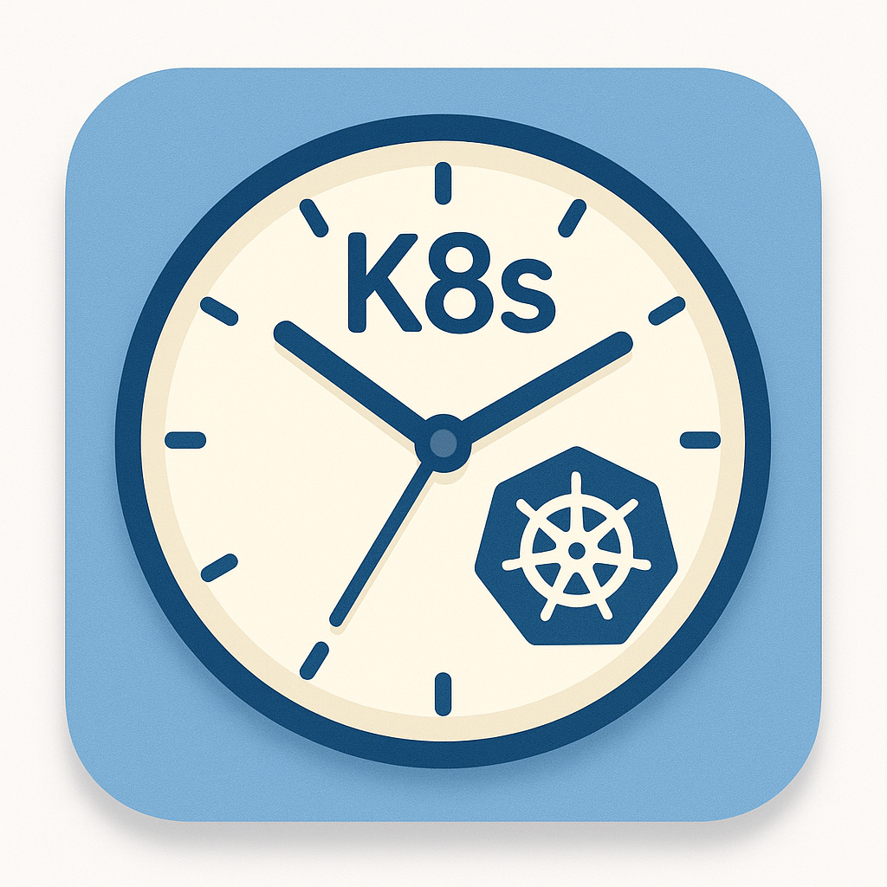

<p align="center">
 
</p>

# Sibyl
> Watch for error events, fetch logs from the problem pod, post em to slack. Simple as that

[](https://artifacthub.io/packages/helm/sibyl/sibyl)


Sibyl allows you to send Kubernetes error alerts with log context to slack!


# Setup
To deploy Sibyl, you need to create a Slack App connected to your workspace where you would like to receive alerts, and then you need to deploy Sibyl into the target Kubernetes cluster that you would like to receive alerts from.

## Create The Slack App
1. Go to Slack Apps, login and on the top right select "Create New App": https://api.slack.com/apps 
2. On the popup select "From Manifest"
3. Select your workspace
4. Flip to the YAML tab, and then upload the manifest located in this repository at: [docs/sibyl-slack-manifest.yml](docs/sibyl-slack-manifest.yml)
5. One created, select Settings > Basic Information and scroll down to the "Display Information" section. Select "Add App Icon"
6. Upload the Sibyl icon located in this repository at: [docs/assets/sibyl-icon.png](docs/assets/sibyl-icon.png)
7. Then go to Settings > Install App and select "Install App To Workspace"
8. Follow the screens and prompts. Note the slack channel you choose, you will need this when you install Sibyl
9. Once complete, go back to Settings > Install App and copy the "Bot User OAuth Token". You will need this when you install Sibyl


## Install Sibyl Into Your Cluster

Install with Helm by running:

```bash
# Add The Repository
helm repo add sibyl https://bensoer.github.io/sibyl
# Install the chart
helm upgrade --install sibyl/sibyl --set slack.channel=<YOUR_SLACK_CHANNEL> --set slack.botToken=<BOT_TOKEN>
```

Set `YOUR_SLACK_CHANNEL` to the channel your selected in step 8 when you installed Sibyl slack app in your workspace

Set `BOT_TOKEN` to the "Bot User OAuth Token" on the Settings > Install App page of your Sibyl Slack App


# Developer Notes
Install development onto minikube by running:

```bash
helm upgrade --install sibyl charts/sibyl --set image.tag=main --set image.pullPolicy=Always
```